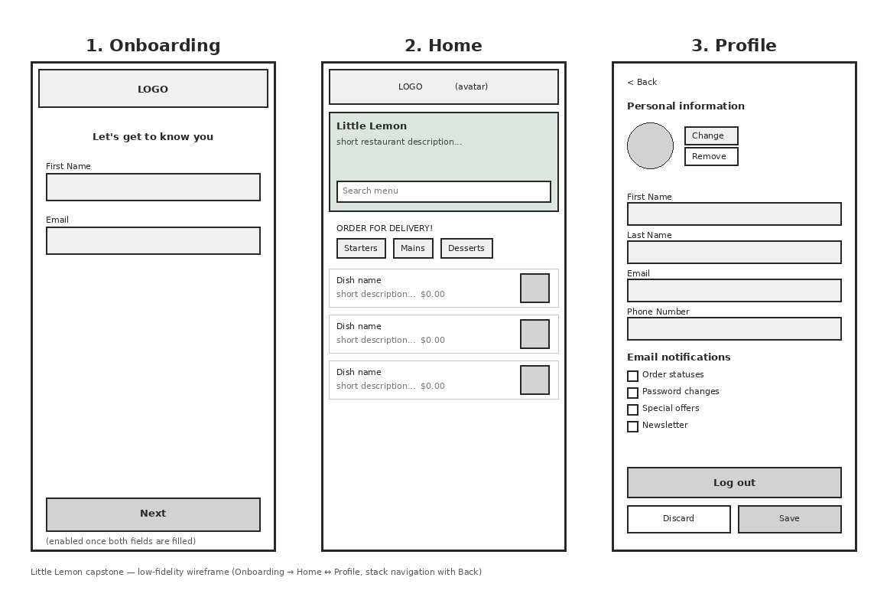

# Little Lemon — React Native Capstone

A React Native (Expo) app for the Little Lemon restaurant, built for the
Meta React Native capstone peer-review assignment. It covers onboarding,
a browsable home menu, and a persisted, editable profile.

**Built on Expo SDK 57.** Make sure the Expo Go app on your test device
is up to date — Expo Go only supports the currently-shipping SDK, and an
older Expo Go build will refuse to open this project.

## Design

`design/wireframe.png` is the low-fidelity wireframe the three screens
below are based on (Onboarding → Home ↔ Profile, connected by stack
navigation with a Back button on Profile).



## Features → rubric checklist

- [x] **Wireframe** the app is based on — `design/wireframe.png`.
- [x] **Onboarding screen** shown on first launch, prompting for First
      Name and Email (`screens/Onboarding.js`).
- [x] **Next button** on Onboarding is disabled until both a non-empty
      first name and a valid email are entered.
- [x] **Relaunching after onboarding opens directly to Home** — `App.js`
      checks `AsyncStorage` on launch and skips Onboarding if it was
      already completed.
- [x] **Home screen layout** contains, in order: header, hero, menu
      breakdown, food menu list (`screens/Home.js`).
- [x] **Header** shows the Little Lemon logo and an avatar button that
      navigates to Profile (`components/Header.js`).
- [x] **Profile screen** loads and displays the data entered during
      onboarding (`screens/Profile.js`, backed by `utils/storage.js`).
- [x] **Changes saved on Profile persist across restarts** — everything
      (including phone number) is written to `AsyncStorage`, not just
      component state.
- [x] **Back button** in the upper-left of Profile returns to Home —
      Profile is pushed via `@react-navigation/native-stack`, which
      supplies the native back chevron automatically.
- [x] **Log out clears all data** — `clearAllData()` removes every key
      the app ever wrote, then resets navigation back to Onboarding
      (prompting the onboarding flow again).
- [x] **Hero section** has a short restaurant description and a search
      bar that filters the menu list live by name.
- [x] **Menu breakdown** shows selectable (toggle on/off) category
      chips: Starters, Mains, Desserts.
- [x] **Food menu list** shows every item with name, description,
      price and image — filtered live by search text and/or the active
      categories (e.g. selecting Mains + Desserts shows exactly Grilled
      Fish, Pasta and Lemon Dessert).
- [x] **Visual design** follows the wireframe layout and the brand
      style guide's colors (`utils/theme.js`) and fonts — Markazi Text
      for display headings, Karla for body/UI text, loaded via
      `@expo-google-fonts` in `App.js`.

## Project structure

```
LittleLemon/
├── App.js                  # NavigationContainer + stack navigator, font loading, onboarding check
├── app.json                # Expo config
├── babel.config.js
├── package.json
├── assets/                 # All images used by the app
│   ├── index.js             # Central image import map
│   ├── logo.png
│   ├── hero-image.png
│   ├── avatar-placeholder.png
│   ├── delivery-van.png
│   ├── greek-salad.png
│   ├── bruschetta.png
│   ├── grilled-fish.png
│   ├── pasta.png
│   └── lemon-dessert.png
├── components/
│   ├── Header.js            # Logo + tappable avatar (→ Profile)
│   ├── Hero.js               # Description + search bar
│   ├── MenuBreakdown.js       # Selectable category chips
│   ├── MenuList.js            # Summarized menu rows
│   └── Checkbox.js            # Small checkbox used on Profile
├── screens/
│   ├── Onboarding.js
│   ├── Home.js
│   └── Profile.js
├── data/
│   └── menu.js               # Static sample menu + categories
├── utils/
│   ├── storage.js            # AsyncStorage keys + helpers
│   └── theme.js               # Brand color palette + font families
└── design/
    └── wireframe.png          # Low-fidelity wireframe (see above)
```

## Running it locally

Requires Node.js and the Expo CLI (installed on demand via `npx`).

```bash
npm install
npx expo start
```

Then press `i` for the iOS simulator, `a` for an Android emulator, or
scan the QR code with the **Expo Go** app on a physical device (make
sure Expo Go is updated to the latest version first — see the SDK note
at the top of this file).

### Verifying it builds without a device

```bash
npx expo export --platform android
npx expo export --platform ios
```

Both should complete with no errors and produce a `dist/` folder; this
is a quick way to confirm the app has no missing modules or syntax
errors before testing on-device.

## Notes for reviewers

- Menu data (`data/menu.js`) is static/sample data — there's no backend
  in this capstone, per the assignment's scope.
- The Profile screen's "Change" photo button uses `expo-image-picker`
  and will ask for photo library permission the first time it's used.
- Notification preferences (order statuses, password changes, special
  offers, newsletter) are included on Profile and persist the same way
  the rest of the profile does, since the original course spec expects
  them alongside the personal-info fields.

## Possible improvements

- Wire the menu up to a real API/local SQLite cache instead of a
  static array, with pull-to-refresh.
- Add a dish detail screen (tapping a row currently does nothing).
- Add form-level inline error messages instead of `Alert` popups for
  invalid email/first name on Profile.
- Persist the active search/category filter across Home visits.
- Add unit tests for the storage helpers and filtering logic.
- Add a "Drinks" category to fully match the four categories shown in
  the course's reference wireframe (currently Starters/Mains/Desserts
  only, since no drink items are in the sample menu).
